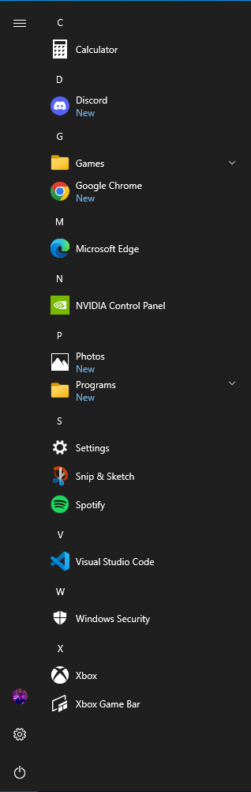

__NOTICE:__ I have not digitally signed this script, which means you will have to set your policy to Bypass to run this script by running `Set-ExecutionPolicy Bypass`. Don't forget to set it back to it's previous state afterward, as this could leave your computer potentially vulnerable.  

If you do not feel safe changing this setting, then don't run this script. This script is open-source so you can look through and see everything it does, however it is generally unwise to run scripts from unknown sources.

Hopefully in the nearby future, I will get this script digitally signed, however I built it just for personal use for the time being, but decided to publish it in case others found value.

---
# Win10/11 Cleanup Script
Windows 10/11 Powershell Script that uninstalls all the bloatware that comes with Windows 10 that nobody uses or wants. It will ask for confirmation about some that MIGHT provide use (Calculator, Camera, etc.) but otherwise uninstalls the rest.

Here is an example of what the Start Menu looks like with stock Windows:  

And here is what it looks like after the script is ran:  
(note that I chose to keep Snip & Sketch, Photos, and Xbox, which can all be optionally uninstalled in the script)  

